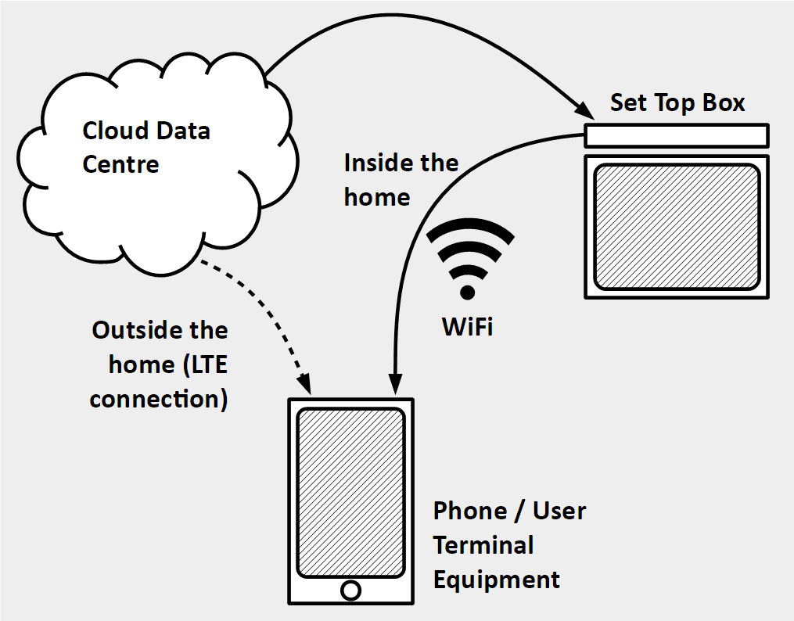
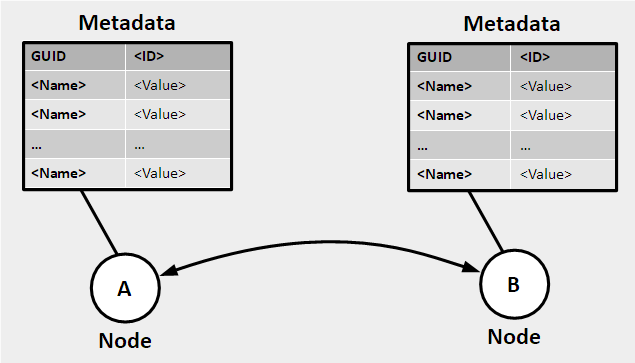
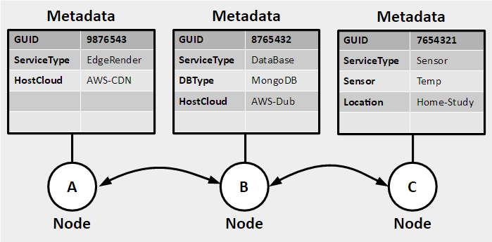
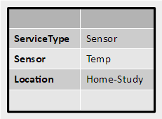
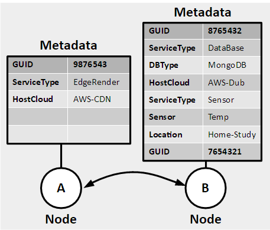
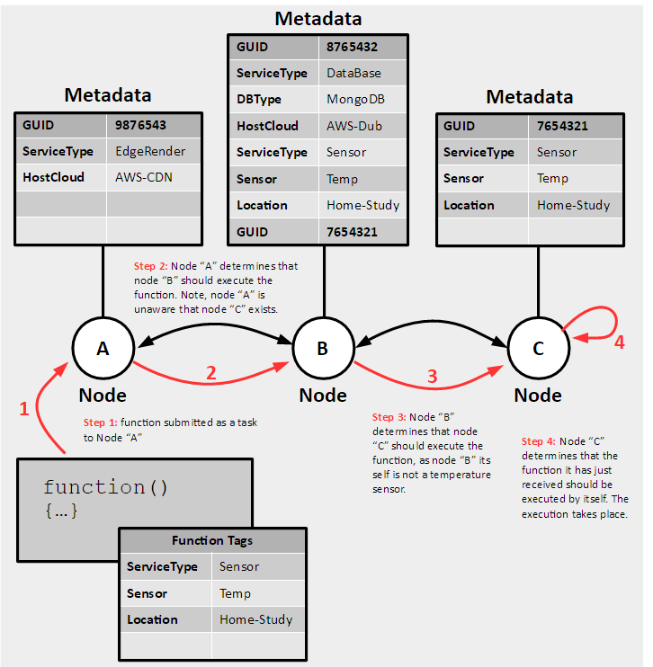
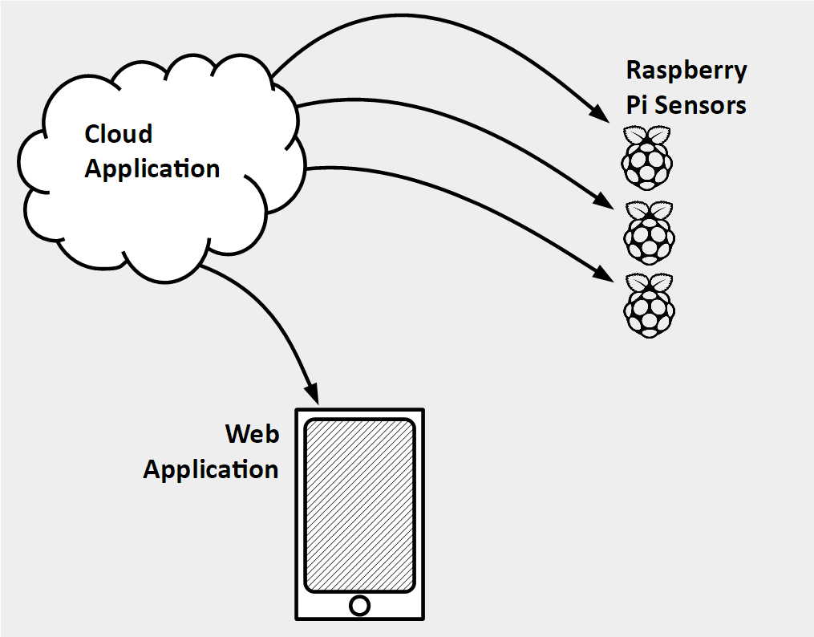
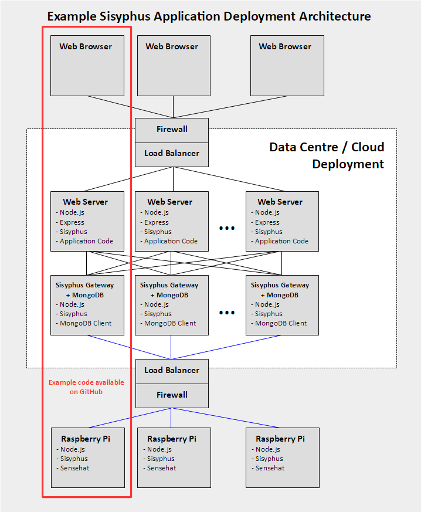
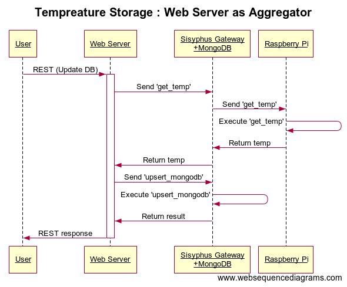
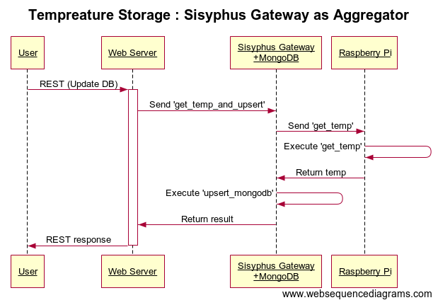

# Creating a Fog of Serverless Functions

**TLDR:** Sisyphus is an actor based programming model, in which functions are sent across a network for execution. This approach was developed between 2011-2013 by Chris Woods who was a researcher at Intel Labs Europe. The work is published and introduced to readers here. This post explains the motivations which prompted the creation of Sisyphus. It highlights the many advantages the approach provides, before providing an open source working example, and outlining the recommended steps to take Sisyphus from concept to a working production implementation. 

## Table of Contents

[TOC]

## Introduction

I have recently been reviewing my CV and LinkedIn profile, and in the process I've been thinking back to the work and research I've undertaken, some of which like "Sisyphus" appears to be of more interest now, then when I first worked on it, especially since the FaaS / Serverless concept didn't really exist when the research was taking place.

In September 2011 I joined Intel Labs Europe and started my first EC (European Commission) sponsored collaborative research project, FI-WARE. My task was to reimagine how clients and cloud servers would communicate. In the process of tackling this I outlined an algorithm, and a framework by which an application could be decomposed into functions, and each function could move about a network for execution. Every function would be tagged with Metadata describing the host computer properties it needed to execute correctly. The computers that are part of the framework are called "nodes", and the "nodes" form a topology via an overlay network. Each node has a corresponding set of metadata; functions are then drawn to the correct node for execution at that node’s location. At the time this experimental framework was called "**Sisyphus**", and it was released under the Apache2 license in 2013, [over a year before](https://en.wikipedia.org/wiki/AWS_Lambda) Amazon's Lambda solution was released. 

### Sisyphus Approach Advantages
The approach offered by Sisyphus provided has a number of advantages across a range of scenarios, compared to traditional server and cloud solutions:

* **Removing complicated IoT APIs**: Each IoT device tends to have its own set of APIs. These define the functionality the IoT device can provide. To change the functionality the device provides, requires changing the API it provides, which in turn mean changing the firmware. This is a costly process. Sisyphus sends functions which execute upon the IoT device, changing the functionality of the code at the edge, is merely a change to the function being sent for execution.
* **Taking advantage of unique hardware and software services** : Data centers, and increasingly edge compute locations contain a collection of heterogenous servers. Some servers are provided with additional hardware to accelerate given tasks. This can range from FPGAs through to vector processing additions. Likewise, different cloud platforms often provide different software services. For instance, Azure offers Machine Learning services, and Amazon can offer it's DynamoDB.  Taking advantage of these capabilities would require the developer to create specific virtual machines, or containers containing code designed to leverage the enhanced hardware / software functionality. Then the developer would need to specify explicitly in an orchestration script which VM image / container should be placed on which type of machine. With  Sisyphus the application is decomposed into a set of functions, and functions are allocated to specific locations in the data centre and automatically queued for execution. Making it really easy to target unique hardware / software resources. 
* **Removing boiler-plate API code**: In creating micro services of platform layers developers define and create a set of APIs, typically in REST. These APIs and interfaces are necessary, but they don't actually deliver any business value. Instead Sisyphus allows developers to focus on the code they need to write to deliver business value, then simply specify where on the network that functionality should execute. This saves developers time and can speed up application development and time to market.
* **Helping with Data Privacy, and Big Data Movement Issues:** I gave a presentation to the EU Vice President which outlined an approach to big data called "Data as a Service". Sharing data is hard, without sophisticated encryption, once you've given someone a copy of your data they have it for good. They can then share it with whoever they want. "Data as a Service" is the inverse of this. Rather than sharing the data, controlled access to the data is instead offered. The "Data as a Service" platform allows users to submit functions which execute against that data. The submitted functions and their generated responses can be checked to ensure that privacy rules are complied with. This approach is safer than simply providing a copy of the data, and since big data is, well *big* it can be expensive for start-ups to enter the market. Providing access to the data and a compute platform to process the data in the form of a "Data as a Service" platform addresses these issues. The Sisyphus framework provides the first major building block for such a service.
* **Providing an easy to use, scalable solution**: Scaling becomes easy with Sisyphus, when a node joins the network and connects to another peer it immediately becomes available and can handle new work. As the network of nodes distributes functions between themselves there is no need for the load balancers or message queues which are often required between services in cloud applications.
* **Easily distributed development**: The Sisyphus framework allows developers to easily create distributed applications. By tailoring the function and node metadata developers can leverage compute, and storage across the network from user devices right through to cloud servers, and everything in between.
* **Reducing Application Latency**: User experience can be dominated by the response time of an application. This is even more true with network-based applications, like modern SaaS and cloud hosted services. It is why CDNs exist. Latency makes a big difference. For these applications the latency of an application can often be attributed to the time it takes a request to be sent to the cloud data center and then returned. Reducing the amount of time the request spends on the network can make a huge difference. Sisyphus allows developers to use "nodes" servers dotted across the network, often at edge locations closer to users than the original cloud location. This reduces the time requests spend travelling across the network and therefore reduce application latency. The edge processing capabilities of Sisyphus map well to the 5G concepts of Edge processing and C-RAN service placement.

Before I describe how Sisyphus works, I should provide you with some context on FI-WARE, as this was the origin of the concepts behind Sisyphus. 

## The Origins of Sisyphus

### FI-WARE
The FI-WARE project was one of the largest collaborative IT focused research projects that the European Commission had undertaken at the time. I was allocated to a small part, dealing with how clients like phones, tablets and PCs connected to cloud servers. In the area of the project I was involved in we had Telecom Italia providing the communication links, and Technicolor providing set-top boxes. The scenario was one in which one or more cloud-based data centers were connected to each other. The data centers then connected to set-top boxes in homes across the country. A user's mobile device could connect to the set-top box, if inside the home, or directly to the cloud data center if outside the home. 




### The Initial Problem
I was concerned about how developers could create an application which would be able to make use of the storage and processing capabilities of each of the locations; user devices, set top boxes, and cloud servers. These locations are dotted along the "bit-pipe" - the connection between the user equipment / terminal and the cloud data center.

From my experience of working at Microsoft and helping to build their Azure cloud platform, I was aware that creating a cloud native application wasn't easy. It is a new development environment and applications and services can require a lot of tuning and customization to work well. The idea of a developer being able to break their application down into small chunks and having each chunk tailored to work on a set-top box, the phone / PC and then the cloud seemed like a huge undertaking. Even after the developer had broken down their application into these components, they'd need to understand which components should run at which location. These technical difficulties would limit any uptake in the newly available processing power available via these new network components.


## The Sisyphus Design

### Basic Principles of Sisyphus

Sisyphus uses an Actor Model to break down an application into functions and then distributes those functions over a network for execution. The basic principle is that code should, wherever possible move across the network to execute in the best possible location that it can. 

To do this Sisyphus assigns metadata to both the function being submitted to the framework for execution and each of the nodes which make up the Sisyphus network. Sisyphus then attempts to match the function to the correct node for execution.

### Framework

#### Metadata

Each node in the network has a unique set of capabilities. These can represent access to specific hardware at that location, software (databases etc.), or even the presence of a specific set of data. All of this is described in metadata for each node. The metadata format is a set of name value pairs.



Functions can be submitted to the network for execution. They are tagged with similarly formatted metadata. The metadata supplied with the functions indicate where on the network the function should be executed. If no metadata is supplied then it is assumed that the function can be directed to *any* node for execution. 

#### Node ID

Every node in the network has a UUID. If necessary, this enables functions to be directed to a specific node for execution.  

#### What happens when a function is submitted

When the local node receives the function for execution, it's first attempt is to execute the function locally on its own node. However, if there is a very long list of functions waiting for execution, or if the metadata of the function doesn't match the local node's meta data then it is sent for execution to a remote node.

The local node is aware of all of the other nodes it is directly connected to (N+1). It maintains a list of these nodes and their associated metadata. It uses this small set of data to forward the function to the best location. 

#### Handling Large Sums of Metadata

Nodes, can of course be connected to other nodes.



The image above depicts an example IoT application which has been deployed with Amazon and a user's own in-home temperature sensor. 

- Node "A" is an AWS instance running in an Amazon CDN location. It receives a request from the user to refresh the temperature reported in the user's home study.

- Node "B" is the cloud data center hosted database, in this case it is an instance of MongoDB.

- Node "C" is the user's sensor, which is deployed in the user's "Home-Study".

Imagine a scenario where the user viewing the web interface wishes to obtain the current temperature from the sensors. In a typical application node "A" would receive the request from the user, it would invoke a function on a cloud hosted service which would trigger the collection of this data. Using the Sisyphus framework this works a little differently.

Rather than implement a middleware service on Node “B”, Node "A" would submit a task which would:


1. Read the latest data from the sensor

2. Update the DB

3. Refresh the UI

This task would be submitted to Sisyphus tagged with the following metadata:



Of course, given the original depiction of the Sisyphus framework as shown above, it would be impossible for node "A" to be aware of node "C". Node "A" would therefore not know how to forward the request to node "C". To address this each node would report their metadata to as follows:

```
X = Node requesting metadata, which is connected to Y
Y  = Node Receiving Metadata
Z = Set of all Nodes connected to Y

Metadata returned to X = metadata(Y) + metadata (Z) – metadata (X)
```

This superset report removes any duplicate metadata definitions and provides a concise report of what services a node and its connected peers can provide. Within the Sisyphus framework, Node "A" see's the network as only one node deep, as depicted below:



Node "A" now sees node "B" as both a Data base server and as a temperature sensor in the user's home-study. Any functions tagged with metadata associated with the user's home study are simply forwarded to B. 

#### What happens when a function is received by a node

When a function is received by a node, the node checks to see if it can itself process the function. If there is a metadata match, and the node's queue is not too full then it will execute the function. However, if the queue is full or if there is no matching metadata then the node will attempt to redirect the function to another child node (excluding the node from which the original request was received). 



In the example given above the function tagged with the need to be executed in the user's home study, will be forwarded from A to B, to eventually C.

#### Metadata Changes

The state of a node can be reflected in the metadata it exposes. This could be some performance data, information about available disk space, CPU temp or load, or for mobile devices information on the device's battery performance. Of course, this information will change over time. Changes to a node’s metadata are propagated to every other attached node. 

### Node Types

In the Sisyphus framework there are three node types. They are distinguished by the way they handle their network connections, as follows: 

- **Client**: This only ever makes connections to either Gateways or to Servers. 
- **Server**: This only ever receives connections from other nodes, either Gateways or Clients.
- **Gateway**: This can receive and make connections.

When a node is created (the Sisyphus framework launched on the target computer) is assigned one of the three roles given above.

## Example Application Using Sisyphus

Consider an IoT application hosted in the cloud which allows users to obtain temperature information from sensors hosted in various locations.  The application presents the user with a simple UI allowing them to graph the latest temperature values, or refresh the graph and obtain the current temperature value. Diagrammatically the concept application would look as follows:



### IoT Example Equipment

For the purposes of this example the sensors in question are Raspberry Pi's with Sense HAT hardware and software extensions. The Sense HAT software extensions allow any running node.js application to obtain the temperature value. In a larger scale deployment the Raspberry Pis may be used as an IoT gateway, this is excluded in this discussion in order to keep the example simplified. 

### Sisyphus Architecture



The architecture presented above looks similar to many enterprise architectures; a Web Server front end and a set of servers behind that handle data storage and execution. What is missing are the microservices one might expect for handling the collection of Raspberry Pis, or specific functionality for dealing with data access or web rendering. This is because the application programming model presented by Sisyphus is significantly different. 

**NB**: *The code for the Raspberry Pi, Sisyphus Gateway + MongoDB, and Web Server can be found on GitHub at this location* : https://github.com/woodsmc/sisyphus


#### Web Server (Application Code)

Because Sisyphus sends code to specific nodes for execution there is no need to deploy specific services / VMs or containers. The developer doesn't have to worry about the layers of the application, they only have to worry about the vertical structure of the application from user request through to back end actions. 

Code on the Web Server is automatically obtained from a Git repository. In this example the Web server presents static content for the web page which provides the user interface and set of REST based interfaces. The REST interfaces invoke Sisyphus tasks, which in turn are passed on to the gateway. For this to function correctly the Web Server must know the IP address or addresses of the Sisyphus Gateways to connect to.

#### Sisyphus Gateway + MongoDB Driver

This is a simple Sisyphus "Gateway" which has been configured with the node.js MongoDB client library. This allows any code sent to this location for execution to leverage the MongoDB driver for node.js. 

As this is a Sisyphus Gateway it can route requests for execution to the correct child nodes. 

Setting up the Sisyphus Gateway is simply a matter of specifying the correct Metadata for the Sisyphus node, and ensuring that the MongoDB driver is available to node.js 

#### Raspberry Pi

The Raspberry Pi is configured with Sisyphus and the node.js extensions to allow access to the Sense HAT temperature sensor. This allows code running on the Pi to have access the Sense HAT. Each Pi is configured with metadata describing its location. The Pi needs to know the address of the Sisyphus Gateway to connect to. As the Gateways are all running inside the cloud data center, and since for security and practicality one would not want to expose them all to the public internet, they reside behind a firewall and load balancer. 

### Application Programming Model

Design patterns exist for a number of traditional enterprise application models, today these fall into two basic categories, horizontal and vertical structures.

In traditional horizontally structured applications developers would design and create layers, a database storage layer, and web processing and front-end layer for example. The layers then work together to service a user request, calling business logic, and databases as necessary. 

Examples of vertically structured applications include microservice based applications. In these applications microservices take end to end ownership of a set of functionalities. They can own their own front-end web rendering, business logic and database.

In each of these models the developer is breaking out functionality and placing, or partitioning it into a logical group, in doing so they create a service, either a layer in the horizontal description provided above, or a microservice in the vertical model. The services themselves expose APIs, these APIs need to be designed coded and maintained. The creation of the API endpoints can result in a lot of boiler-plate code. Creating this boiler-plate code can be time consuming for a developer, and it takes times away from working on functionality which is actually critical to business value. 

Sisyphus offers a different programming model. The developer is aware that there are different machines available with different capabilities. But they write their application, similarly to the vertical structure, as a set of single, user invoked function chains. Rather than defining layers with APIs, or microservices with APIs the Sisyphus developer simply writes the code to implement the functionality they require, marking each function with the location in which it should execute.

This way the developer can think about the functional chain of user actions, without needing to worry about partitioning code, they simply write what they need to execute. Scaling is provided intrinsically by the framework. Each function that is tagged by the developer for execution within Sisyphus becomes an asynchronous invocation point and therefore a point in which scaling can occur.

The Sisyphus developer therefore does not have to spend time designing a logical partitioning of code, they merely have to write what they want to execute, annotating and marking functions for execution within Sisyphus as necessary. 

#### Reading the Temperature

Consider the issue of getting the latest temperature value from one of the Pi devices in the example application. In a partitioned application the developer may have created a service which is responsible for all Pi devices and provides an API which allows a caller to specify the device they want the temperature value from. In Sisyphus the developer writes their code to read the value from the Pi directly, then specifies which Pi to execute the code upon.

The following function returns a JavaScript object containing the temp and the time the temperature was taken.

```javascript
function get_temp() {
    console.log("getting the temp... ");
    var path = require('path');
    var fs = require('fs');
    var directory = path.join(
        path.dirname(fs.realpathSync(__filename)), '../examples/pi_sensehat');
    const sense_hat = require(directory + '/sensehat');
    var currentTemp = sense_hat.getTemp();
    var now = new Date().getTime();
    var retval = {
        temp : currentTemp,
        time : now
    };

    console.log("temp returning: " + JSON.stringify(retval));
    return retval;		
}
```

To tell Sisyphus to execute the function on the Raspberry PI, we need to specify the target node's metadata. As described above the PI advertises itself with the following metadata:


This is specified like this in javascript:

```javascript
var tempsource = new $sis.MetaData({
    ServiceType : "Sensor",
    Sensor : "Temp",
    Location : "Home-Study"	
}, $sis.NodeType.GATEWAY);
```

This uses the `$sis` Sisyphus framework object to create a new metadata object and specifies the metadata as indicated in the image above.

To execute the function, we must submit it and its metadata to Sisyphus. This is done by issuing a task to Sisyphus as follows:

```javascript
$sis.task( get_temp, tempsource)
```

This call will return a promise object. So to be notified of when the function has been executed and to get the results of the function we need to handle the returned promise object. This is done by changing the code as follows:

```javascript
$sis.task( get_temp, tempsource).then( function(result){
    var time = new Date( result.time ).toUTCString();
    console.log("pi informs me that the temp it see's is " + result.temp + " on  " + time);
});
```

The `get_temp` function is submitted as a task to Sisyphus. The function is automatically serialized, transmitted to the destination Sisyphus node which has matching metadata defined by `tempsource` metadata object. Once it arrives at the destination node it is executed, and the results of the execution are then returned to the caller via the promise object. In the example above the `result` function parameter contains the data structure returned by the `get_temp` function; this is the object with the `time` and `temp` properties.

#### Reading the Temperature and then Storing in MongoDB

The `get_temp` function can then be used to update the database with the latest value from a given device, imagine for simplicity sake a function called `upsert_mongodb` which can update the database with some new data. The `upsert_mongodb` must be executed on a node which has access to the MongoDB client. These two functions can be chained together as follows:

```javascript
$sis.task( get_temp, tempsource).then( function(result){
   	var mongo_db_dest = new $sis.MetaData({
		ServiceType : "DataBase",
		DBType : "MongoDB"	
	}, $sis.NodeType.GATEWAY);
    
    $sis.task( upsert_mongodb, result).then( function(result){
       console.log("database updated with latest temp value");
    });
    
});
```

The developer can see the entire chain of events from requesting the temp to storing it inside the database. This is a simple vertical slice of functionality. The code above would:

1. Send the `get_temp` function to the Pi for execution: `$sis.task( get_temp, tempsource)`
2. Wait for the temperature to be returned from the Pi: The first `.then( function(result))`)
3. Once the temperature has been returned send the returned data to a Sisyphus Gatway + MongoDB node `$sis.task( upsert_mongodb, result)` for storage.
4. Wait for the data to be stored, then write a debug message: The second `.then( function(result))`)

If this was executed by a user who was interacting with a web page delivered by the web server it would present the follow sequence of actions:



As you can see the Web Server is performing the work of an aggregator. In order to reduce the network traffic, and indeed the work needed to be performed by the Web Server it is easily possible to move the point of aggregation to the Sisyphus Gateway as follows: 

```javascript
function get_temp_and_upsert(payload, callerMetadata, responseHandler) {
    responseHandler.delayResponse = true;
    $sis.task( get_temp, tempsource).then( function(result){
        upsert_mongodb( result );
        console.log("database updated with latest temp value");
        responseHandler.respond(result);
    });
}

var mongo_db_dest = new $sis.MetaData({
    ServiceType : "DataBase",
    DBType : "MongoDB"	
}, $sis.NodeType.GATEWAY);

$sis.task( get_temp_and_upsert, mongo_db_dest ).then( function( result ){
    console.log("DB has saved the new temp object : " + JSON.Stringify( result ));
});


```

This code sends a new function `get_temp_and_upsert` to the Sisyphus Gateway + MongoDB node for execution. You will also notice that the function now takes as set of parameters these are as follows:

- `payload` : Every Sisyphus task accepts a payload, this is the data to be passed to the function when it is executed.
- `callerMetadata` : This is the metadata object from the node which issued the request for execution.
- `responseHandler` : This object allows the developer to control when Sisyphus notifies the caller that the function submitted to Sisyphus as been executed.

Typically, Sisyphus assumes that the function being executed remotely will return a value which needs to be sent back to the original caller of the function. A caller is the node which submitted the function to the Sisyphus framework for execution. However JavaScript is asynchronous, therefore there are conditions when a node must block, and wait for another process to respond back before replying to the caller with the response. This is one such example. Here the code informs Sisyphus that is should wait until the function explicitly tells it to reply to the caller: 

```javascript
responseHandler.delayResponse = true;
```

It waits until the Raspberry Pi has provided it the temperature, stores it in the Database and then signals back to the Web Server that the work has been completed:

```javascript
responseHandler.respond(result);
```

This produces the following changes to the sequence of events:




As you can see above the interactions between the Web Server and the Sisyphus Gateway are reduced.

## Next Steps

The purpose of the original Sisyphus project was to show that a serverless approach could provide a useable programming model for developers across the entire "bit-pipe" of a network. In this regard the proof of concept was a success. 

### Benefits

The Sisyphus model provides a number of benefits:

* The programming model in Sisyphus allows a developer to concentrate on the work they need to perform, without having to worry about partitioning code into specific services. 
* The infrastructure automatically adapts to new nodes joining or leaving the network and can support nodes both inside and outside of the cloud, right the way down to individual pieces of user equipment.
* Code deployment becomes a case of updating the code on a small subset of all the nodes in an application, in the example given this is the Web Server; there is no need for large catalogues of stored functionality.
* The developer can think and code about their core functionality. The vertical function chain the developer write can often be held in a single source file. The developer does not have to deal with multiple services

### Improvements

As mentioned Sisyphus is a proof of concept. There are a number of improvements needed to get Sisyphus ready for a production environment. Some of these key items are outlined below. 

#### Debugging Support and Console Output

As `printf` or logging debug output is most developers go-to for initial debugging. Because Sisyphus distributes running code across a number of nodes for execution this for of debugging doesn't work, the log output resides of multiple machines. To address this some way of collecting the logging output from each of the distributed nodes and presenting it to a developer is needed.

#### Code Dependency and Large Task Sizes

Sisyphus is not a language extension. When you submit a task ( function ) to Sisyphus it serializes the function only, not the context of the function. The context includes all the variables available the function at the time of execution. This means that if your function tries to use a variable, or indeed to invoke another function which resides outside of its scope it will fail. All the dependencies of a function have to be included within the scope of the function so that they are serialized and transmitted to the destination server for execution. One of the sides effects of this is that it becomes hard to share common functions between Sisyphus tasks, the following code for example will not work: 

```javascript
function CommonFunction() {
	return 42;
}

function B() {
    var answerToLife = CommonFunction();
    // ... 'B' specifc some functionality ...
    return answerToLife;
}

function C() {
    var answerToLife = CommonFunction();
    // ... 'C' specifc some functionality ...
    return answerToLife;
}

$sis.task( C, metadata ).then( function(result) {
    console.log("The answer to life the universe and everything is " + result);
});
```

Instead the developer must include `CommonFunction` within the scope of both the C and B functions, resulting in code like this:

```javascript
function B() {
    // nested function 
    function CommonFunction() {
        return 42;
    }
    
    var answerToLife = CommonFunction();
    // ... 'B' specifc some functionality ...
    return answerToLife;
}

function C() {
    // nested function 
    function CommonFunction() {
        return 42;
    }
    
    var answerToLife = CommonFunction();
    // ... 'C' specifc some functionality ...
    return answerToLife;
}

$sis.task( C, metadata ).then( function(result) {
    console.log("The answer to life the universe and everything is " + result);
});
```

This becomes code reuse by copy and paste, which is obviously not great as it affects maintainability and increases the overall code size of an application. Additionally, it means that the size of the functions being sent around the network for execution increases.

#### Reduce the Cost of Repeatedly Sending the Same Function

A related issue is that in the current implementation the same function is repeatedly sent over the network for execution. This of course consumes a lot of network bandwidth. There are a number of ways to do this. One such way may be to have the node which receives a function for execution can hash the function and cache it locally. The hash for the function can be advertised in the metadata of the receiving node, informing nearby nodes that this function has been cached. The next time the function is submitted for execution the sending node can hash the function to be sent and select a node which advertises that it has cached the function. Then, rather than resending the same function the originating node can submit the hash. This reduces the network bandwidth consumed by repeatedly sending the same function.

#### Introduce Error Handling

At the moment if a node fails, any function which has been submitted to the failing node will essentially vanish. Currently this can leave nodes which have submitted tasks blocked, hanging while they wait for a response. To address this, we need to introduce error handling, and function execution tracking. There are a number of ways to achieving this, including using a dedicated message queue like RabbitMQ, or implementing the error and retry handling in node.js. 

#### Separation of Control Plane and Execution Plane

In the current proof of concept implementation the control plane, which handles the queuing and signaling of function execution also executes the functions submitted to Sisyphus. This means that executing functions can get access to the control mechanics of the Sisyphus framework. There are a number of issues with this including security and the stability of the framework when executing badly performing functions. To address this the Sisyphus implementation will need to separate the control process from the execute process. This isolation will ensure that if an executing function crashes the framework can remain operational, and that deliberate attempts to reconfigure the existing framework by a function submitted to Sisyphus will not succeed.


#### Introducing Automated Scaling 

Sisyphus was originally designed for the Fog and it handles new nodes joining and leaving the network well. However it does not have any automated scaling features, and these would need to be implemented.

##### The Scaling Action

As mentioned in the description of steps a Sisyphus node takes, when it receives a function for execution, the node will try to pass a function it has received on to another node with matching metadata if it determines that the queue of tasks it has to execute is too long. 

For the example temperature sensor application, scaling would mean adding new instances of the Sisyphus Gateway +MongoDB node. When this happens the Web Server nodes need to be informed of the presence of the new node, so that they can add the new instance as a direct link. If the network of nodes were to be replaced by RabbitMQ as suggested above in the discussion on error handling, then this may not be needed.

##### Triggering the Scaling Action

In the current implementation it is possible to trigger a scaling action by monitoring the queue lengths of each of the available nodes. If the queues are too long, add a node, inversely if they are too short remove one.

By monitoring the queue length of each node it is possible to determine when to add or remove a Sisyphus node.

##### Cloud Management API

For scaling to work there needs to be a management API which can add and remove instances of Sisyphus nodes. This could be cloud or container framework specific. This has not been implemented yet, as at the time of Sisyphus' implementation it was out of scope.


## Conclusion

The Sisyphus concept has shown that it is possible to create a Fog of Serverless functions. The approach of dynamically sending functions across a network for execution opens up a range of advantages for developers. From the easy vertical way they can address problems, to reducing the time they need to craft services and API boiler-plating. 

However, for the Sisyphus approach to go live in a production environment a re-implementation is required, one which will build upon the work already undertaken in the proof of concept and address the suggested improvements mentioned above.

The industry has moved on since Sisyphus was first created, and now there are a number of FaaS / Serverless open source environments available. Many of these projects have encountered similar issues and have designed solutions to address them. One such example is OpenWhisk from IBM. It lacks the Actor-Model and function transmission concepts outlined in Sisyphus, but it does provide a robust platform. Therefore, there are two suggested approaches to move forward: 

1. Leverage the insights from platforms like OpenWhisk and use them to help redesign Sisyphus.
2. Study how one of these platforms could be modified to provide the Actor-Model and function transmission concepts outlined in Sisyphus.


## About the Author

Chris Woods is a research lead and software architect who has specialized in cloud infrastructure research and concepts. Most recently he was working with a global telecommunication equipment provider on exploring programming models for handling globally distributed applications. He has led teams, managed large and small projects, and designed and written everything from device drivers for mobile phones through to cloud infrastructure software. Hire him now: <https://www.linkedin.com/in/woodsmc>/ 


**Note**
The work which created Sisyphus was originally done via the FI-WARE project. The original documentation can be found online on the [FI-WARE website](https://forge.fiware.org/plugins/mediawiki/wiki/fiware/index.php/Distributed_Compute_API_Specification).


